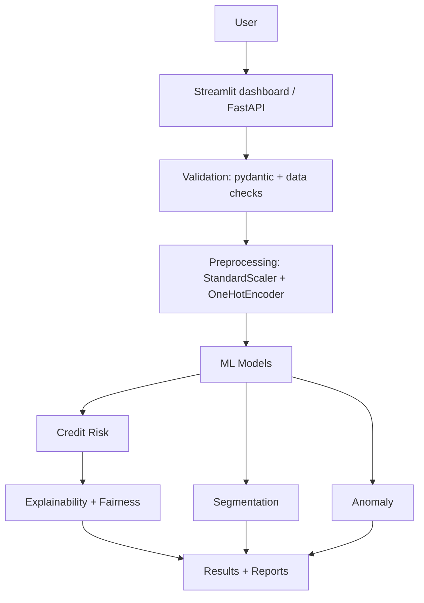

# AI-Powered Credit Risk & Financial Decision Support Platform

> Decision-support system on the 1000-row German-credit-style dataset bundled in `data/raw/`.
> Predictions are **not** loan approvals or financial advice.

## Problem
Lenders need consistent, explainable first-pass risk screening; customers need
understandable feedback, not a black-box score.

## Solution
One reproducible sklearn pipeline serves a Streamlit dashboard **and** a FastAPI
backend: risk classification with per-decision reasons, KMeans segments,
IsolationForest anomaly review queue, transparent loan rules, and
prediction-based fairness reports.

## Key Features
- Credit-risk classification (LR / RF / GradientBoosting compared, best saved)
- Per-prediction explanation from real model features + global importance
- Customer segmentation (scaled KMeans, silhouette + elbow, data-derived profiles)
- Anomaly detection (IsolationForest; "needs review", never "fraud confirmed")
- Rule-based loan recommendations with affordability math and disclaimer
- Fairness report by `personal_status`, `employment`, age band
- Streamlit dashboard (10 tabs) + FastAPI (`/predict-risk`, `/detect-anomaly`,
  `/customer-segment`, `/recommend-loan`, `/model-metrics`, `/health`)
- pytest suite (11 tests), Docker, GitHub Actions CI

## Architecture


## ML — actual results (recomputed by `scripts/train.py`, 80/20 stratified split)
| model | acc | prec | rec | F1 | ROC-AUC | CV-F1 |
|---|---|---|---|---|---|---|
| LogisticRegression | 0.705 | 0.776 | 0.814 | 0.794 | 0.759 | 0.835±0.041 |
| RandomForest (balanced, 300 trees) | 0.725 | 0.815 | 0.786 | 0.800 | 0.789 | 0.831±0.030 |
| **GradientBoosting (selected)** | **0.760** | **0.815** | **0.850** | **0.832** | **0.773** | 0.827±0.022 |

Selected on test F1. Note: misses ~1 in 4 — this is a screening aid, and
false negatives (missed bad risks) vs false positives (denied good customers)
have different business costs; recall is reported prominently for that reason.
- Clustering silhouette: k=2: 0.121, k=3: 0.093, k=4: 0.098, k=5: 0.089 (default k=4).
- Anomaly: IsolationForest, contamination 0.10 → 100/1000 flagged.

## Explainability
Global importance (coef/importance) + per-prediction top-5 transformed features
with plain-English mapping, e.g. "Past repayment history influenced the score."

## Fairness
Approval (predicted-good) rate, TPR/FPR/FNR, precision/recall per group for
`personal_status`, `employment`, age band, plus max approval gap. Gaps are
flagged as *signals to investigate*, not proof of discrimination.

## Installation

Requires Python 3.11+. Tested on Python 3.14 (all dependencies —
scikit-learn, pandas, numpy, matplotlib, FastAPI, Streamlit, pytest, httpx —
install cleanly on 3.14, so no version downgrade is needed).

Always use `python -m <tool>` (not bare `uvicorn` / `streamlit`): on Windows
the `Scripts/` folder is often not on `PATH`, so bare commands fail with
"'uvicorn' is not recognized..." even when the package is installed.
`python -m` bypasses `PATH` entirely. This is an environment quirk, not an
application bug.

### Windows setup (CMD)
```bat
python -m venv .venv
.venv\Scripts\activate
python -m pip install --upgrade pip
python -m pip install -r requirements.txt
python scripts/check_environment.py
python scripts/train.py
```

PowerShell activation instead uses `.venv\Scripts\Activate.ps1`.

Then run the API (Terminal 1):
```bat
python -m uvicorn app.api:app --host 127.0.0.1 --port 8001
```

In a second terminal (activate `.venv` again first), run the dashboard (Terminal 2):
```bat
python -m streamlit run app/streamlit_app.py --server.port 8502
```

Run tests:
```bat
python -m pytest tests/ -q
```

Endpoints:
- API: http://127.0.0.1:8001 (root returns service info; `/health` for health)
- Swagger: http://127.0.0.1:8001/docs
- Dashboard: http://localhost:8502

### Linux / macOS setup
```bash
python3 -m venv .venv
source .venv/bin/activate
python -m pip install --upgrade pip
python -m pip install -r requirements.txt
python scripts/check_environment.py
python scripts/train.py
python -m uvicorn app.api:app --port 8000
python -m streamlit run app/streamlit_app.py
python -m pytest tests/ -q
```

## Usage
```bash
# API
python -m uvicorn app.api:app --host 127.0.0.1 --port 8001
# Dashboard
python -m streamlit run app/streamlit_app.py --server.port 8502
# Tests
python -m pytest tests/ -q
```

## API
| method | endpoint | body |
|---|---|---|
| GET | `/health` | — |
| GET | `/model-metrics` | — |
| POST | `/predict-risk` | `CustomerRecord` |
| POST | `/detect-anomaly` | `CustomerRecord` |
| POST | `/customer-segment` | `CustomerRecord` |
| POST | `/recommend-loan` | `LoanRequest` |
Validation errors return 422; missing artifacts return 500 with the fix command.

## Docker
```bash
docker build -t credit-risk .
docker run -p 8000:8000 credit-risk
docker compose up
```

## Screenshots
`screenshots/` holds placeholders — run the dashboard and add:
`overview.png`, `risk.png`, `fairness.png`.

## Project Structure
- `src/` — config, data_loader, preprocessing, credit_risk, clustering, anomaly,
  fairness, loan_recommender, finance_advisor
- `app/` — `api.py`, `schemas.py`, `streamlit_app.py`
- `scripts/train.py` — trains + saves all artifacts + metrics
- `models/` — pickles + `credit_risk_metrics.json` (generated, git-ignored)
- `data/raw/credit_customers.csv` — dataset (see `docs/DATASET.md`)
- `tests/` — 11 pytest tests
- Legacy flat files (`credit_risk_model.py`, `dashboard.py`, …) remain at repo
  root for reference; new code does not depend on them.

## Limitations
- Synthetic/educational 1000-row dataset, not real bank data; no missing values
  by construction, so real-world messiness is understated.
- No SHAP (kept dependency-light); local reasons are coefficient/importance based.
- Fairness groups use dataset proxies (e.g. `personal_status`), small samples.
- Class imbalance 70/30; no cost-sensitive threshold tuning yet.

## Future Improvements
- Threshold tuning by business cost; calibrated probabilities
- SHAP + counterfactual "what would flip this decision"
- MLflow model registry; drift monitoring; pagination/auth for API
